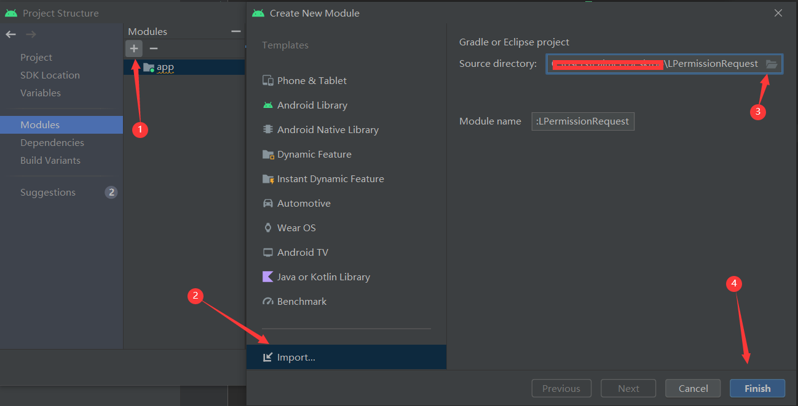
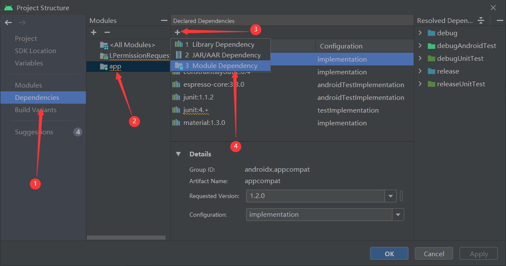
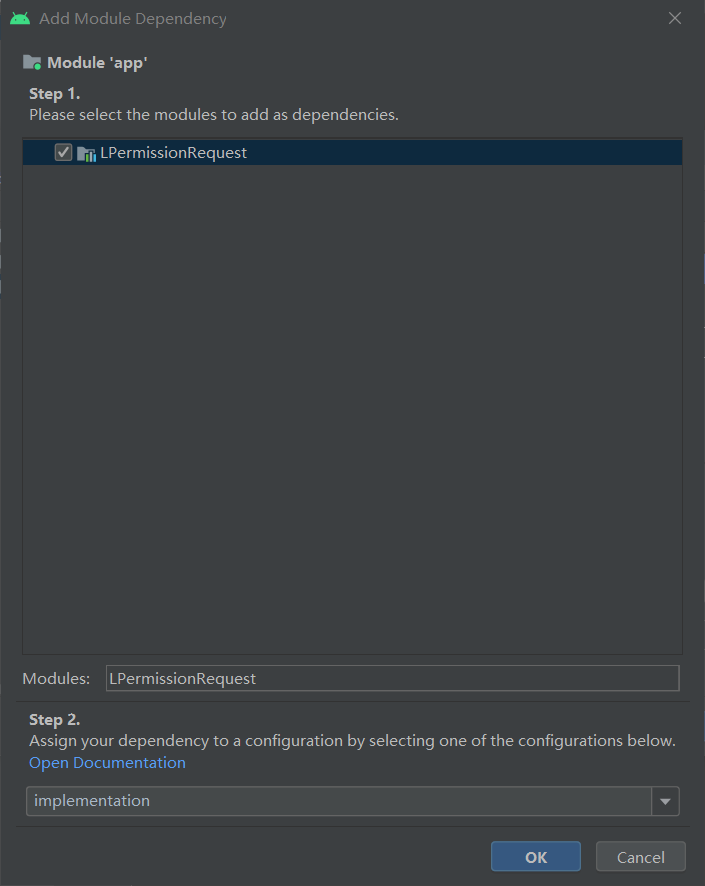

# LPermissionRequest

Android权限动态申请库，根据[https://github.com/MZCretin/FanPermission](https://github.com/MZCretin/FanPermission)学习，添加了注释、修改部分代码

## 用法

### 导入依赖

导入module



添加Module Dependency






## 代码示例

```java
LPermissionHelper.with(this)    // 添加上下文环境
        // 添加要赋予的权限
        .addPermissions(Manifest.permission.CAMERA,Manifest.permission.READ_PHONE_STATE,
                Manifest.permission.READ_SMS,Manifest.permission.SEND_SMS,
                Manifest.permission.RECORD_AUDIO,Manifest.permission.WRITE_EXTERNAL_STORAGE,
                Manifest.permission.ACCEPT_HANDOVER)
        // 设置强制申请权限(一直弹窗) 默认false
        .setForceAllGranted(true)
        // 设置对话框内容(可选)
        .setForceDeniedTips("未授权，请前往设置手动授予")
        // 设置成功回调与失败回调
        .onResult(new LPermissionCallback() {
            @Override
            public void onRequestSuccess() {
                Log.d("MainActivity", "onRequestSuccess: ");
            }

            @Override
            public void onRequestFailed(String[] grantedPermissions, String[] deniedPermissions, String[] forceDeniedPermissions) {
                Log.d("MainActivity", "onRequestFailed: ");
            }
        })
        // 进行权限的检查申请
        .check();
```

